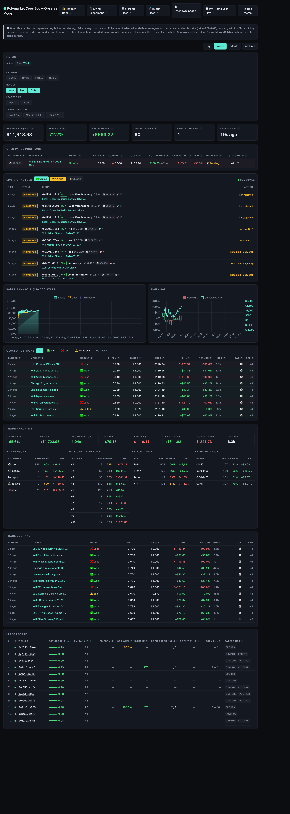
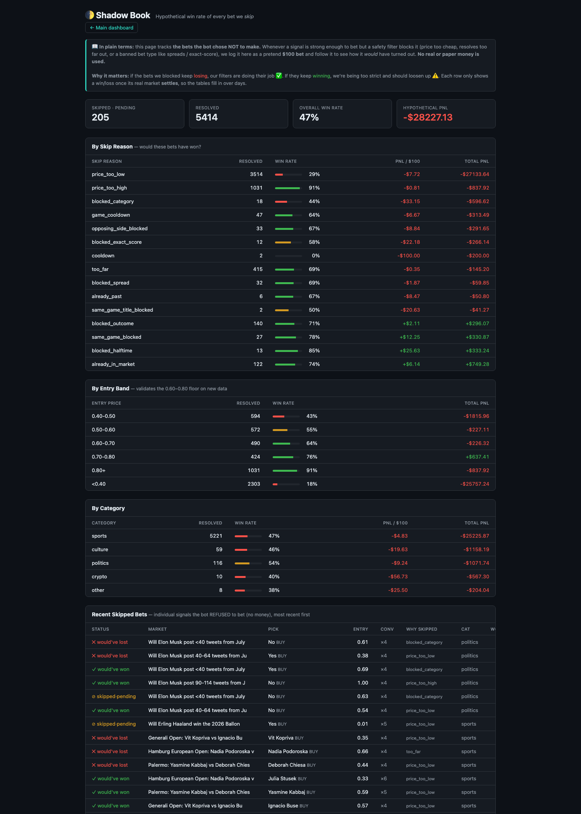
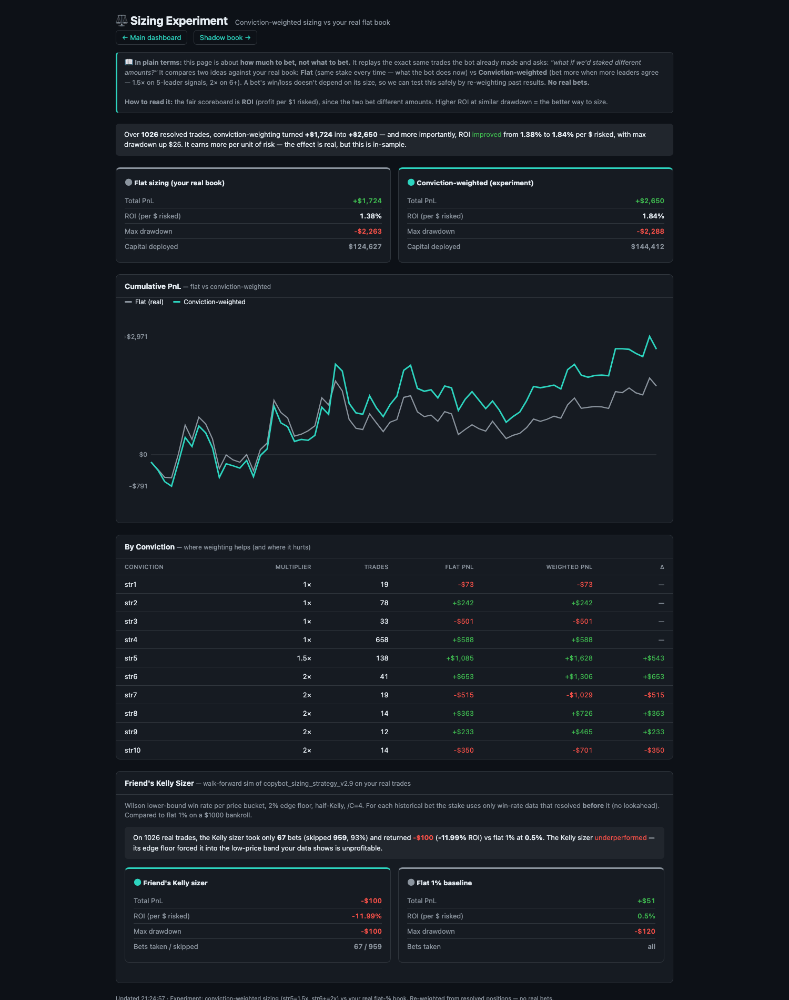
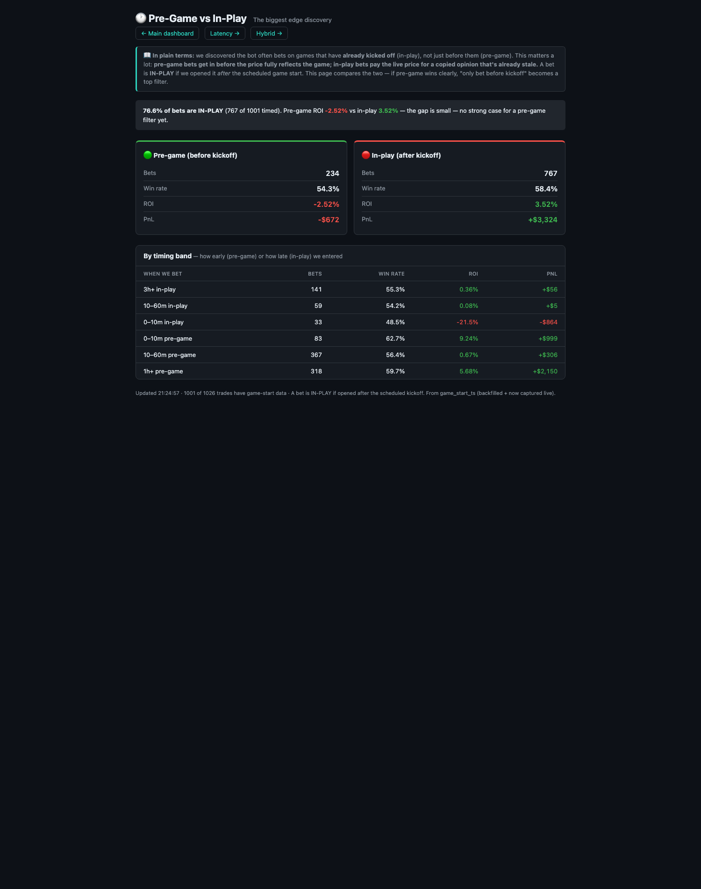

# Polymarket Copy-Trading Bot — and the measurement system that kept it honest

A paper-trading bot that copies profitable Polymarket traders when several independently
agree on the same outcome — plus, more importantly, **the analytics stack I built to find out
whether the edge was real.**

Python · asyncio · SQLite · FastAPI · vanilla-JS dashboards · ~950 resolved paper trades over 3 months

> **Status:** paper trading only. No real money has been placed. The interesting part of this
> project isn't the bot — it's the measurement work, including the several times the data
> proved my own conclusions wrong.

---

## The short version

The naive version of this bot ("copy good traders") made **+$804** over ~950 paper trades — a
thin, unconvincing edge. Building a measurement layer around it revealed *why*, and produced a
strategy that would have made **~4× more** by mostly **removing** things:

| Change | Effect on all-time P&L |
|---|---|
| Blocked spread / handicap markets | **+$2,380** |
| Blocked over/under totals | +$722 |
| Blocked exact-score markets | +$419 |
| Raised minimum entry price to 0.60 | +$1,195 |

**All four are the same insight:** the edge is *"who wins."* Every market that asks something
else — *by how much*, *what exact score*, *the total* — quietly bled money while looking fine on
win rate. Spreads alone lost **−$2,380** at a respectable 46% win rate.

---

## Architecture

```
Polymarket Data API                     ┌─────────────────────────────┐
        │  (poll ~100 ranked leaders)   │  Analytics / research layer │
        ▼                               │  ─────────────────────────  │
  watcher.py  ──► signal_filter.py ──►  │  shadow book (bets we skip) │
   (parallel     (conviction gate:      │  sizing simulators (5)      │
    fetch)        4+ leaders agree,     │  latency / slippage decay   │
        │         quality-weighted)     │  pre-game vs in-play        │
        ▼                               └─────────────────────────────┘
   paper_book.py ──► filters ──► position          ▲
   (sizing, all skip logic)                        │ every skipped bet,
        │                                          │ every alternative,
        ▼                                          │ tracked forward
   resolver.py / exit_monitor.py ────────► SQLite ─┘
                                             │
                                       server.py (FastAPI) ──► 6 dashboards
```

**Core loop** (`worker.py`): parallel poll of ~100 ranked leaders every 15s → conviction filter →
paper position → resolution + adverse-exit monitoring. Leaders are re-scored every 6h and the
top-50 Polymarket leaderboard is merged in hourly, so the tracked pool stays fresh.

---

## What I actually learned (the point of the project)

### 1. Derivative markets were eating the edge
Win rate is a misleading metric when payoffs are asymmetric. Spreads won 46% of the time and
still lost **−$2,380** — because "team wins by 2+" is a different question than "team wins," and
only the second one is what copied consensus predicts. Same story for over/under and exact-score.

### 2. Cheap favorites are a trap
Bucketing every trade by entry price found the 0.50–0.60 band lost **−$1,762** while 0.60–0.80
made **+$1,870**. At ~0.50 the leaders were betting *against* market consensus and the market was
usually right — adverse selection, not edge.

### 3. The bot was betting *in-play* without me knowing
I tried to implement **closing line value** (CLV) — the standard skill metric in sports betting.
It wouldn't compute, and the reason turned out to be the most valuable finding in the project:
**~2/3 of bets were placed after kickoff.** You can't beat a closing line you entered *after*.
That single fact explained the thin edge, and a latency anomaly I'd been unable to interpret.

### 4. Faster copying was *worse*, not better
Intuition says a copy-trading edge is perishable — copy faster, earn more. The data said the
opposite: copies placed <60s after the leader ran **negative ROI**, while 2–5 minute copies were
the profit center. Controlling for category, entry price, and conviction, the effect *strengthened*.
A "skip if too slow" filter — which I'd been about to build — would have actively hurt.

### 5. A rigorous sizing model can still be wrong for your edge
A collaborator proposed a well-built fractional-Kelly sizer (Wilson lower-bound win rate, edge
floor, correlation-adjusted caps). Simulated walk-forward on real trades, it **lost −12% ROI** —
its edge floor forces bets into the cheap-favorite band that my own data showed is a trap. I kept
his risk architecture (circuit breakers, exposure caps) and rejected the sizing math, with numbers.

### 6. Small samples lie — repeatedly
A 180-trade sample said pre-game bets earned **4.5× more** than in-play. Compelling, mechanistic,
and **wrong**: the full 932-trade backfill reversed it. Three separate findings in this project
looked strong at small sample and dissolved at full sample. That's why every filter is now
validated *forward* on data it wasn't derived from.

---

## The measurement layer

Because the honest answer to "does this edge exist?" is usually *"not yet provable"*, most of the
work went into instrumentation rather than strategy tweaks:

| Tool | Question it answers |
|---|---|
| **Shadow book** | What's the win rate of the bets we *decline*? (validates every filter forward) |
| **Sizing simulators** | Flat vs conviction-weighted vs Kelly vs hybrid — re-weighted on real outcomes |
| **Latency / slippage decay** | Where does the copy edge die — in time, or in price? |
| **Pre-game vs in-play** | Are we betting before or after the event starts? |

Every one is read-only analysis over real resolved trades — no simulated outcomes, no lookahead.
The sizing and CLV backfills are **walk-forward**: each historical bet is scored using only data
that existed before it.

---

## Screenshots

<!-- Add screenshots to docs/screenshots/ and they'll render here -->
| | |
|---|---|
|  |  |
| *Live positions, signal feed, analytics* | *Win rate of bets we skipped* |
|  |  |
| *Flat vs conviction-weighted sizing* | *The in-play discovery* |

---

## Documentation

- **[CHANGELOG.md](CHANGELOG.md)** — every release, with the evidence behind it
- **[docs/STRATEGY.md](docs/STRATEGY.md)** — strategy rationale in depth, including
  the ideas that were tested and **rejected** (leader-performance selection,
  raising the conviction threshold, ranker-score improvements). Those matter as
  much as the changes that shipped — each looked plausible and cost money in
  simulation.

Strategy changes are only shipped after **out-of-sample validation**: a finding
must hold on data it was not derived from.

## Running it

```bash
pip install -r requirements.txt
cp .env.example .env          # add your Telegram token if you want alerts
python worker.py              # the bot
uvicorn server:app --port 8000   # dashboards
```

Strategy parameters live in `config.yaml` (entry band, conviction threshold, blocked market types,
exit rules). `strategy_version` is bumped on every meaningful change so results stay attributable.

---

## Honest limitations

- **Paper only.** Fills are simulated from the live order book; real slippage and latency are
  unproven, and on an edge this thin they could erase it.
- **Single regime.** Most data sits inside one World Cup. Post-tournament behaviour is untested.
- **Thin edge.** ~1.5% ROI per dollar risked, dependent on a high win rate against unfavourable
  payoffs — a few points of win-rate decay flips it negative.
- **In-sample risk.** Several filters were derived from the same dataset they're measured on.
  That's why the shadow book and forward validation exist, and why the strategy is currently frozen.

I'd rather show a project with a credible list of what it *can't* prove than one that claims an
edge it hasn't earned.

## Tech

`asyncio` worker with parallelised polling (5× throughput improvement), SQLite in WAL mode with
tuned busy-timeouts for concurrent writers, FastAPI + dependency-free JS dashboards, systemd
services, Telegram alerting, automated log/DB maintenance with disk-pressure alarms.
